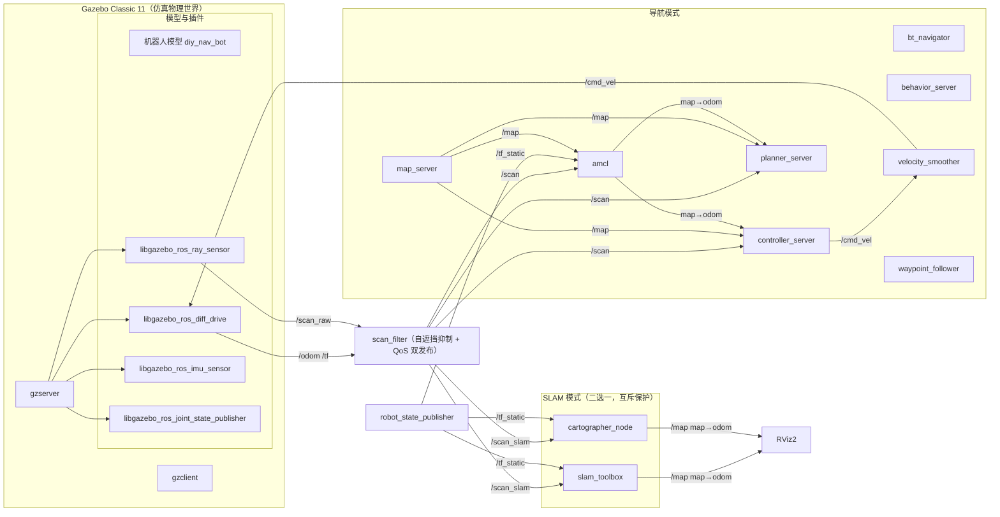
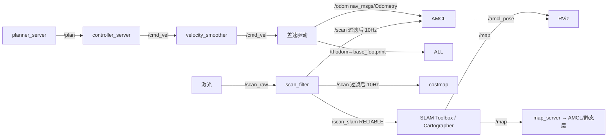
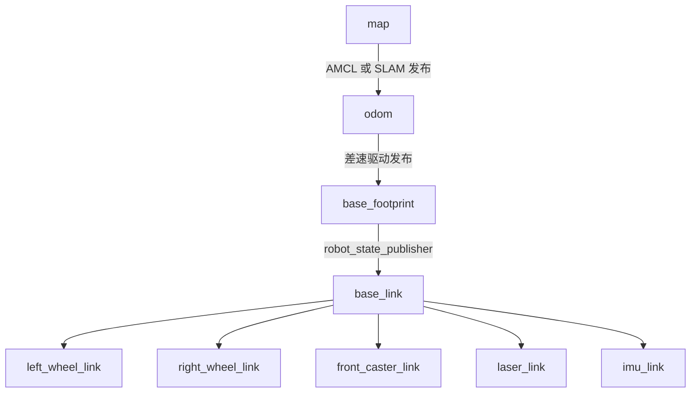
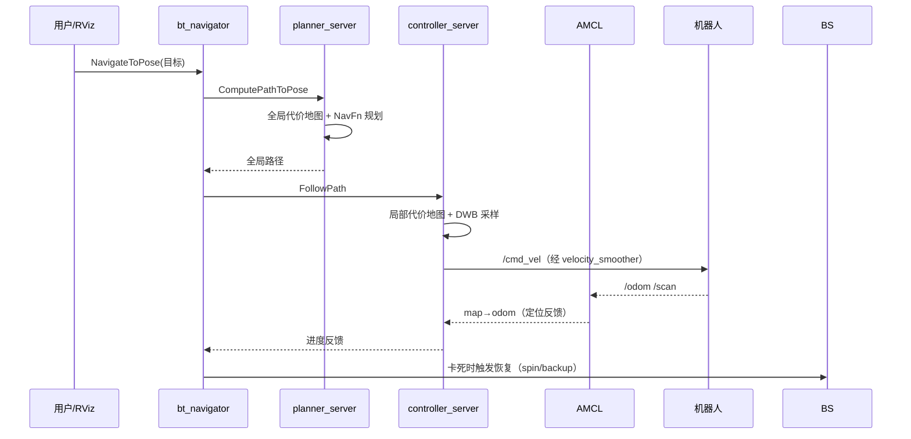
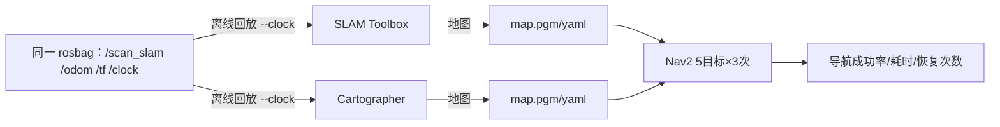

# 系统架构（system_architecture.md）

## 1. 系统节点图

## 2. Topic 数据流图

## 3. TF 树

TF 单一来源原则：`odom → base_footprint` 仅由差速驱动发布；`map → odom`
仅由 AMCL 或 SLAM（互斥运行）发布；其余由 robot_state_publisher 发布；
无任何静态 TF 伪造。

## 4. Nav2 工作流程

## 5. SLAM 工作流程（两种方案共用数据）

